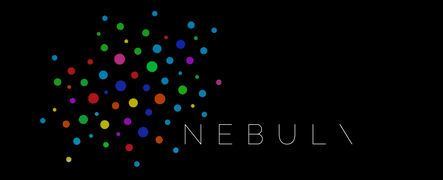

### [NEBUL\\](https://nebula-color-moods.herokuapp.com/)


This application will track your state of mind with a single click.

Each emotional state is represented by a color to this app. For each day a user logs onto the site and chooses the color that best represents their mood, their choice will be stored into a database. All entries are available for future review in the form of a personalized, unique spectrum.

Users can choose to complete missons that are scientifically proven to help elevate and improve mood, as well as add notes to document their day.

The compiled data will provided an overview of the mental state of the user, as well as insight to how seasons, weather, and location affects their moods.

## Getting Started

These instructions will get you a copy of the project up and running on your local machine for development and testing purposes. See deployment for notes on how to deploy the project on a live system.

### Prerequisites

You will need

* [Node.js](https://nodejs.org/en/)
* [MySQL](https://www.mysql.com/)

### Installing

Fork, clone, or download the code base from GitHub. Then

```
npm install
```

to get the modules you need.

Then create SQL database using

```
schema.sql
```

## Deployment

Deployment is through Heroku using JAWs addon for MySQL and Sequelize

## Built With

* [Sequelize](http://docs.sequelizejs.com/)
* [Passport](http://www.passportjs.org/)
* [React](http://www.reactjs.org)
* [modernizr](https://modernizr.com/)
* [Granim](https://sarcadass.github.io/granim.js/)
* [Canvas](https://github.com/hustcc/canvas-nest.js)
* [Particles.js](https://vincentgarreau.com/particles.js/)
* [Materialize](https://materializecss.com)
* [Bootstrap](https://getbootstrap.com/)
* [Google Fonts](https://fonts.google.com/)
* [Nightmare](http://www.nightmarejs.org/)
* [amCharts](https://www.amcharts.com/)
* [canvas-nest](http://git.hust.cc/canvas-nest.js/)
* [JAWs](https://devcenter.heroku.com/articles/jawsdb)


## Running the tests

We used Nightmare to create tests. To run the tests enter
```
npm test
```
on the command line.

Once running the test will create a new user and log them into the site, creating a screen capture at the moment of on-click event.

## Authors

* **Ryn Escarra-Cypher** - [rescarra](https://github.com/rescarra)
* **Gintas Vasiliauskas** - [GintasVasiliauskas](https://github.com/GintasVasiliauskas)
* **Enrique Rojas** - [ero646](https://github.com/ero646)
* **Laura Wentzell-Ahmad** - [laah](https://github.com/laah)
